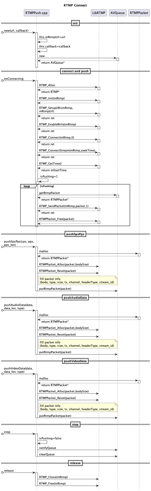

## 核心逻辑说明
- rtmp 初始化、建联、发包、停止、释放等 

### 启动稳定性
- 为避免在不支持的 ABI（如 x86/x86_64 模拟器）上因加载 `libAVRtmpPush.so` 失败导致的启动崩溃，`RtmpSender` 改为惰性创建：仅在用户发起推流时才实例化并加载 native 库。
- 若设备架构不支持，会给出 Toast 提示且不再崩溃；真机（arm64-v8a/armeabi-v7a）不受影响。
