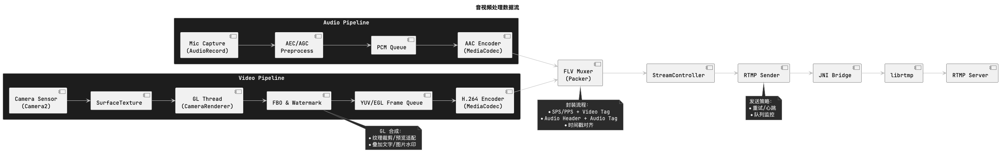
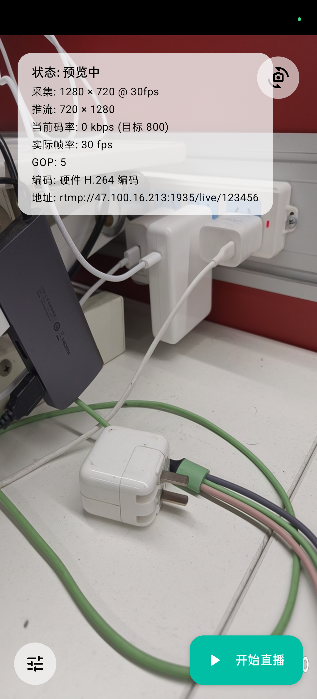
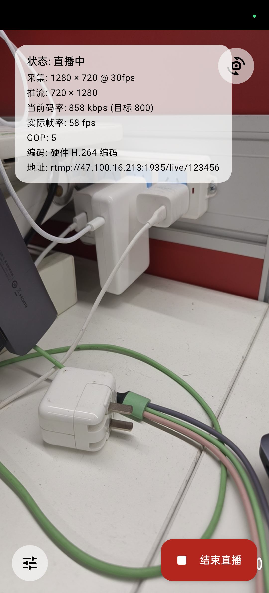
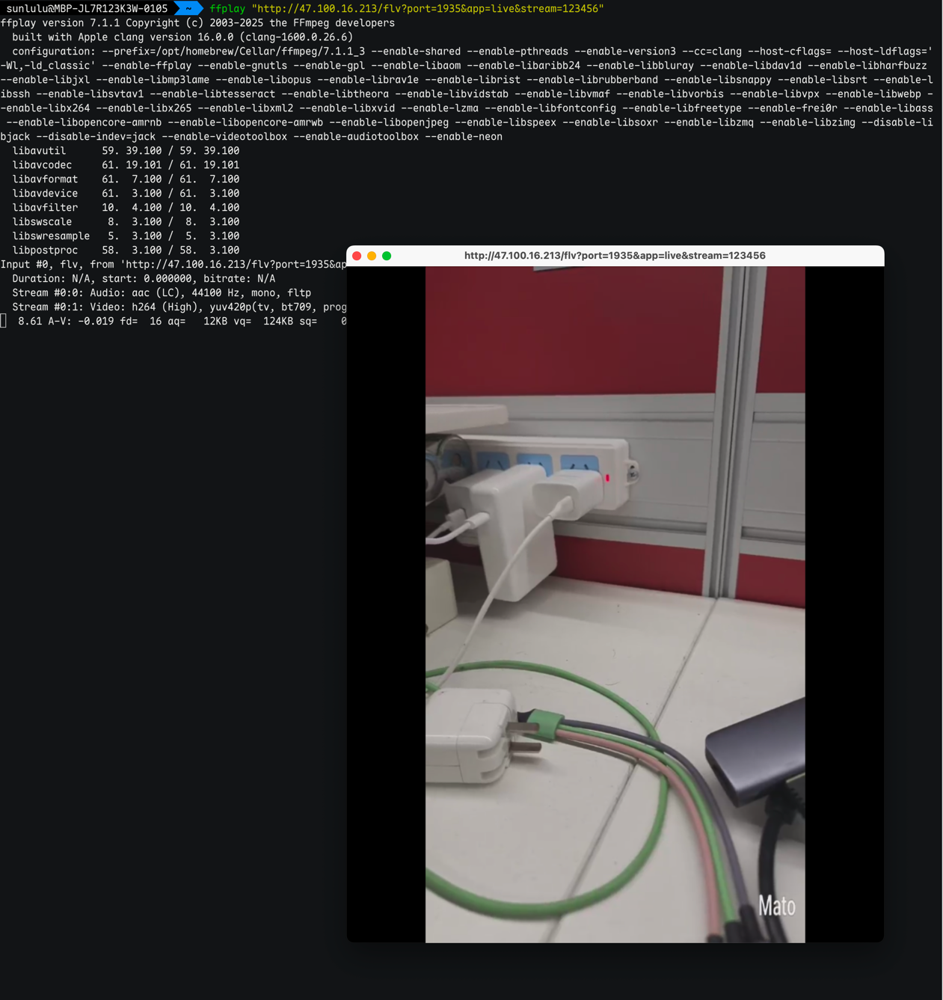

# AVRtmpPushSDK

AVRtmpPushSDK is a Kotlin + C++ streaming toolkit that delivers end-to-end AV capture, processing, encoding, FLV packaging, and RTMP uplink. The repository contains a demonstration Android app ("**AstraStream**") and a reusable library that powers hardware-accelerated live streaming pipelines.

## Contents

- [Key Capabilities](#key-capabilities)
- [Architecture Overview](#architecture-overview)
- [Getting Started](#getting-started)
- [Live Session Lifecycle](#live-session-lifecycle)
- [Extensibility](#extensibility)
- [Tooling & Diagnostics](#tooling--diagnostics)

## Key Capabilities

- Hardware-based audio and video encoding via `MediaCodec`
- Adaptive bitrate control at runtime
- Camera parameter tuning with front/back switching
- Safe camera bootstrapping with automatic fallback to 720p preview when a requested profile is unsupported
- Audio preprocessing (AEC/AGC) and capture configuration APIs
- OpenGL watermark composition and FBO based rendering
- FLV muxing and RTMP delivery backed by `librtmp`
- Orientation-aware preview with seamless live/preview transitions
- Session UI persists RTMP URL, encoder, resolution, and bitrate selections for quick relaunches

## Architecture Overview

The project follows a clean architecture split:

- **UI Layer** – `app/` demo (`LiveScreen`, `LiveSessionCoordinator`) and `widget/AVLiveView`
- **Use-Case Layer** – `controller/*` orchestrating capture/encode/package/send
- **Device/Infrastructure** – `camera/*`, `mediacodec/*`, `stream/*`, native `librtmp`

Core data-flow and component diagrams are authored in PlantUML with selective highlighting:

| Color | Layer | Components |
| --- | --- | --- |
| 🟡 **Gold** | **Core Processing** | CameraRenderer, VideoEncoder, FLV Packer, RtmpPacker - Critical transformation logic |
| ⚫ **Dark Gray** | **Control Layer** | StreamController, AVLiveView, VideoController - Business coordination |
| ⬛ **Gray Variants** | **Other Layers** | UI, Infrastructure, External systems - Supporting components |

The minimalist color scheme highlights only the most critical processing components, reducing visual noise while maintaining clear architectural boundaries.

| Diagram | Purpose |
| --- | --- |
| [`docs/av_dataflow.puml`](docs/av_dataflow.puml) | High-level audio/video pipeline from capture to RTMP |
| [`docs/video_capture.puml`](docs/video_capture.puml) | Camera setup, preview, and sensor flow |
| [`docs/video_render.puml`](docs/video_render.puml) | GL thread, FBO, and watermark rendering |
| [`docs/video_encode.puml`](docs/video_encode.puml) | `MediaCodec` session management |
| [`docs/video_streaming.puml`](docs/video_streaming.puml) | FLV muxing and RTMP sender interactions |

> CI runs `tools/render_docs.sh` to publish PNG/Markdown artifacts in the `docs-diagrams` workflow artifact. Run the script locally to regenerate visuals as needed.

### Audio/Video Data Flow

The end-to-end live pipeline is summarised in the PlantUML diagram below. It tracks a frame (and its paired PCM buffers) across capture, GPU processing, encoding, FLV packaging, and RTMP transmission.



- **Source:** `docs/av_dataflow.puml`
- **Regenerate:** `./tools/render_docs.sh` (requires `plantuml` on PATH; emits assets into `docs/generated/` which remain untracked)
- **Highlights:** Camera frames flow through `GLSurfaceView` → `CameraRenderer` (FBO + watermark) → `VideoEncoder`; audio samples are captured and encoded in parallel, both converging inside the `StreamController` which multiplexes FLV and pushes via `RtmpSender`.

## Getting Started

### Prerequisites

- Gradle 8.6 with Android Gradle Plugin 8.4.2 and Kotlin 1.9.24
- JDK 17
- Android SDK 34 (compile/target) with minimum API level 21
- Android NDK 27.1.12297006
- CMake 3.22.1

### Clone and Build

```bash
git clone git@github.com:sunlulu427/AVRtmpPushSDK.git
cd AVRtmpPushSDK

# assemble demo app & release AAR
./gradlew :app:assembleDebug :library:assembleRelease
```

The demo Activity (`LiveActivity`) now renders a Material 3 Compose interface (`LiveScreen`) driven by a coordinator (`LiveSessionCoordinator`). It wires an `AVLiveView` into the Compose tree, applies default **720 × 1280 @ 30fps** capture/stream settings, and exposes encoder selection, bitrate tuning, and live controls. Streaming is optional—users can leave the RTMP address empty to stay in preview-only mode—and the entire experience runs in an immersive, edge-to-edge layout.

## Live Session Lifecycle

`AVLiveView` bridges UI interactions to the streaming pipeline through the `LiveStreamSession` interface. The Compose-based demo wraps it with `AndroidView`, configuring capture and streaming parameters as soon as the view is available:

- `LiveSessionCoordinator` centralises all `AVLiveView` wiring:

```kotlin
AndroidView(
    factory = { context -> AVLiveView(context).also(coordinator::attachLiveView) },
    modifier = Modifier.fillMaxSize()
)

// Automatically retries with 720×1280 if the requested profile is unsupported
LogHelper.i("LiveSessionCoordinator", "camera preview ready with 720x1280")
```

- Compose UI keeps the parameter sheet, stats overlay, and FAB states in sync with `LiveUiState`.
- Camera startup logs now surface the selected preview size and emit a warning when a fallback profile is applied, enabling quick diagnosis of device-specific limitations.
- The floating action button opens the RTMP dialog when no URL is set, so preview remains available even without streaming.
- Watermark text automatically scales with the configured capture resolution so branding stays legible across devices.

Typical runtime sequence:

1. Configure audio, video, and camera parameters (defaults to 720 × 1280 @ 30 fps)
2. Attach packer (`FLV`) and sender (`RTMP`)
3. Call `startPreview()` to spin up camera GL pipeline
4. Open RTMP connection and invoke `startLive()`
5. Use `setVideoBps()` for adaptive bitrate, `setMute()` for audio mute
6. Stop via `live.stopLive()`, `sender.close()`, `packer.stop()`

Watermarks can be queued before GL initialization—`AVLiveView` applies them once the renderer is ready.

### Live Session States

- **Before Push** – UI prepared with camera preview and parameters ready to edit.
  
- **Pushing** – Uplink established, stats overlay and live controls in streaming mode.
  
- **Pulling Preview** – Downstream playback state for verifying the live stream output.
  

## Extensibility

Implement `LiveStreamSession` to swap streaming strategies (e.g., different packer, custom sender) without touching UI code:

```kotlin
class FileRecordingSession : LiveStreamSession { /* ... */ }

live.attachStreamSession(FileRecordingSession())
```

The interface exposes lifecycle hooks (`prepare`, `start`, `pause`, `resume`, `stop`) and configuration APIs, promoting dependency inversion and testability.

## Tooling & Diagnostics

- `tools/render_docs.sh`: generate diagram PNG/Markdown in `docs/generated/`
- `tools/diagnose_camera.sh [waitSeconds]`: automated ADB script for camera/GL troubleshooting (defaults to 8s delay before log capture and writes filtered output to `diagnostics/camera-startup-<timestamp>.log`)
- GitHub Actions (`.github/workflows/ci.yml`): builds the app/AAR and uploads rendered diagrams for every push/PR

Refer to [AGENTS.md](AGENTS.md) for detailed development guidelines, Clean Architecture rules, and logging/diagnostic expectations.
