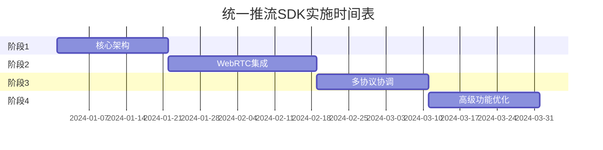

# 实施计划

## 概述

本文档详细描述了AVRtmpPushSDK统一推流接口的实施计划，包括开发阶段、时间安排、资源分配、风险评估和质量保证措施。

## 项目目标

### 主要目标
1. 实现统一的多协议推流接口
2. 保持100%向后兼容性
3. 支持RTMP和WebRTC同时推流
4. 提供智能切换和自适应功能
5. 优化性能和用户体验

### 成功指标
- 接口迁移成功率 > 95%
- 性能相比现有版本提升 > 20%
- 多协议推流稳定性 > 99%
- 开发者满意度 > 4.5/5

## 开发阶段

### 阶段1: 核心架构实现（2-3周）

#### 目标
建立统一推流接口的核心架构和基础设施。

#### 主要任务

**第1周: 核心接口设计**
- [ ] 定义UnifiedStreamSession接口
- [ ] 实现SessionController核心逻辑
- [ ] 设计TransportConfig配置系统
- [ ] 创建StateFlow状态管理
- [ ] 建立错误处理框架

```kotlin
// 里程碑1.1: 核心接口定义完成
interface UnifiedStreamSession {
    val state: StateFlow<SessionState>
    suspend fun prepare(context: Context, surfaceProvider: SurfaceProvider)
    suspend fun start()
    suspend fun stop()
    // ... 其他方法
}
```

**第2周: 配置系统实现**
- [ ] 实现AudioConfig/VideoConfig/CameraConfig
- [ ] 创建DSL构建器系统
- [ ] 添加配置验证逻辑
- [ ] 实现配置热更新机制
- [ ] 编写配置系统单元测试

```kotlin
// 里程碑1.2: 配置系统完成
val session = createStreamSession {
    video { width = 1280; height = 720 }
    audio { sampleRate = 44100; bitrate = 128_000 }
}
```

**第3周: RTMP适配器实现**
- [ ] 创建RtmpTransport实现
- [ ] 集成 NativeSenderBridge 句柄
- [ ] 实现RTMP状态管理
- [ ] 添加RTMP错误处理
- [ ] 编写RTMP传输测试

```kotlin
// 里程碑1.3: RTMP适配完成
class RtmpTransport(config: RtmpConfig) : StreamTransport {
    override suspend fun connect() { /* 实现 */ }
    override suspend fun send(data: StreamData) { /* 实现 */ }
}
```

**第4周: Native Sender Bridge 下沉**
- [ ] 定义 `NativeSenderBridge` JNI 接口（create/connect/close/encoder）
- [ ] 使用 `NativeSenderFactory` 替代所有 Kotlin `Sender` 接口
- [ ] 建立 `NativeSenderRegistry`，集中处理回调与错误码映射
- [ ] 验证 `LiveSessionCoordinator` 业务流程只依赖轻量句柄
- [ ] 补充 C++/Kotlin 双向回归测试

```kotlin
// 里程碑1.4: 业务只依赖 NativeSender
val sender = NativeSenderFactory.createForProtocol(TransportProtocol.RTMP)
sender.setOnConnectListener(listener)
sender.connect(pushUrl)
streamController.setSender(sender)
```

#### 交付物
- 核心接口定义
- 基础配置系统
- RTMP传输适配器
- 单元测试覆盖率 > 80%
- 技术文档更新

#### 风险和缓解措施
| 风险 | 概率 | 影响 | 缓解措施 |
|------|------|------|----------|
| 现有代码集成复杂度高 | 中 | 高 | 提前进行架构分析，创建详细的集成计划 |
| 性能回归 | 低 | 高 | 建立性能基准测试，持续监控 |
| 接口设计不够灵活 | 中 | 中 | 进行多轮设计评审，收集团队反馈 |

### 阶段2: WebRTC集成（3-4周）

#### 目标
集成WebRTC协议支持，实现信令处理和媒体传输。

#### 主要任务

**第1周: WebRTC基础架构**
- [ ] 选择和集成WebRTC库
- [ ] 实现PeerConnection管理
- [ ] 创建ICE候选处理
- [ ] 建立媒体流管理
- [ ] 设计信令协议

**第2周: 信令服务器集成**
- [ ] 实现WebSocket信令客户端
- [ ] 创建房间管理逻辑
- [ ] 添加Offer/Answer处理
- [ ] 实现ICE候选交换
- [ ] 处理连接状态变化

```kotlin
// 里程碑2.1: 信令系统完成
class SignalingClient(private val url: String) {
    suspend fun connect()
    suspend fun joinRoom(roomId: String)
    suspend fun sendOffer(offer: SessionDescription)
    fun observeAnswers(): Flow<SessionDescription>
}
```

**第3周: WebRTC传输实现**
- [ ] 创建WebRtcTransport类
- [ ] 实现音视频数据发送
- [ ] 添加连接质量监控
- [ ] 处理网络变化
- [ ] 实现自动重连机制

```kotlin
// 里程碑2.2: WebRTC传输完成
class WebRtcTransport(config: WebRtcConfig) : StreamTransport {
    override suspend fun connect() { /* WebRTC连接逻辑 */ }
    override suspend fun send(data: StreamData) { /* 发送到PeerConnection */ }
    override fun getConnectionQuality(): ConnectionQuality { /* 质量评估 */ }
}
```

**第4周: 集成测试和优化**
- [ ] 端到端WebRTC推流测试
- [ ] 性能优化和内存管理
- [ ] 错误处理和恢复机制
- [ ] 与RTMP传输的协调测试
- [ ] 文档和示例更新

#### 交付物
- WebRTC传输实现
- 信令服务器客户端
- 集成测试套件
- 性能基准报告
- WebRTC使用文档

#### 技术挑战
1. **WebRTC库选择**: 评估libwebrtc vs 第三方库
2. **信令协议设计**: 确保与现有系统兼容
3. **NAT穿透**: 处理复杂网络环境
4. **音视频同步**: 确保多协议同步

### 阶段3: 多协议协调（2-3周）

#### 目标
实现多协议同时推流、智能切换和状态同步。

#### 主要任务

**第1周: 传输管理器**
- [ ] 实现TransportManager核心逻辑
- [ ] 创建传输优先级管理
- [ ] 添加负载均衡算法
- [ ] 实现故障转移机制
- [ ] 建立传输状态同步

```kotlin
// 里程碑3.1: 传输管理器完成
class TransportManager {
    suspend fun addTransport(config: TransportConfig): TransportId
    suspend fun removeTransport(transportId: TransportId)
    suspend fun switchPrimaryTransport(transportId: TransportId)
    suspend fun sendToAllActive(data: StreamData)
}
```

**第2周: 智能切换系统**
- [ ] 实现连接质量监控
- [ ] 创建切换决策算法
- [ ] 添加自适应码率控制
- [ ] 实现平滑切换机制
- [ ] 建立切换历史记录

```kotlin
// 里程碑3.2: 智能切换完成
class IntelligentSwitchingManager {
    fun startMonitoring()
    suspend fun evaluateAndSwitch()
    fun observeQualityChanges(): Flow<ConnectionQuality>
}
```

**第3周: 统一会话管理**
- [ ] 完善UnifiedStreamSession实现
- [ ] 集成所有子系统
- [ ] 实现会话生命周期管理
- [ ] 添加资源清理逻辑
- [ ] 完成端到端测试

#### 交付物
- 完整的多协议支持
- 智能切换系统
- 统一会话管理
- 综合测试报告
- 性能分析报告

### 阶段4: 高级功能和优化（2-3周）

#### 目标
实现高级功能，优化性能，完善用户体验。

#### 主要任务

**第1周: 高级功能实现**
- [ ] 实现插件系统架构
- [ ] 添加自定义传输协议支持
- [ ] 创建详细统计监控
- [ ] 实现录制功能集成
- [ ] 添加水印和滤镜增强

**第2周: 性能优化**
- [ ] 内存池管理优化
- [ ] 并发处理优化
- [ ] 网络传输优化
- [ ] 编码器性能调优
- [ ] 电池使用优化

**第3周: 用户体验完善**
- [ ] 错误消息本地化
- [ ] 调试工具完善
- [ ] 示例应用优化
- [ ] 文档和教程完善
- [ ] 开发者工具集成

#### 交付物
- 完整功能的SDK
- 性能优化报告
- 完善的文档体系
- 示例应用
- 开发者工具

## 资源分配

### 团队组成

**核心开发团队（4人）**
- 架构师/技术负责人 × 1
- Android高级开发工程师 × 2
- 音视频专家 × 1

**支持团队（3人）**
- 测试工程师 × 1
- DevOps工程师 × 1
- 技术文档工程师 × 1

### 工作量估算

| 阶段 | 人日 | 核心开发 | 测试 | 文档 |
|------|------|----------|------|------|
| 阶段1 | 42 | 32 | 6 | 4 |
| 阶段2 | 56 | 42 | 8 | 6 |
| 阶段3 | 42 | 32 | 6 | 4 |
| 阶段4 | 42 | 30 | 8 | 4 |
| **总计** | **182** | **136** | **28** | **18** |

### 里程碑时间表



## 质量保证

### 测试策略

#### 单元测试
- 目标覆盖率: > 85%
- 自动化执行: 每次提交
- 工具: JUnit 5, Mockk, Coroutines Test

```kotlin
class SessionControllerTest {
    @Test
    fun `should start streaming when all transports are ready`() = runTest {
        // 测试实现
    }
}
```

#### 集成测试
- 组件间交互测试
- 多协议协调测试
- 网络异常处理测试

#### 端到端测试
- 真实环境推流测试
- 多平台兼容性测试
- 性能压力测试

#### 性能测试
- 内存使用监控
- CPU占用分析
- 网络带宽效率
- 电池消耗测试

### 代码质量

#### 静态分析
- Detekt: Kotlin代码规范检查
- Android Lint: Android特定问题检查
- SonarQube: 代码质量分析

#### 代码审查
- 所有代码必须经过审查
- 架构变更需要架构师批准
- 性能敏感代码需要专家审查

#### 持续集成
```yaml
# GitHub Actions 配置示例
name: CI
on: [push, pull_request]
jobs:
  test:
    runs-on: ubuntu-latest
    steps:
      - uses: actions/checkout@v2
      - name: Setup JDK
        uses: actions/setup-java@v2
        with:
          java-version: '17'
      - name: Run tests
        run: ./gradlew test
      - name: Run integration tests
        run: ./gradlew connectedAndroidTest
```

## 风险管理

### 技术风险

#### 高风险项
1. **WebRTC集成复杂度**
   - 风险: 集成时间超预期
   - 缓解: 提前进行技术验证，准备备选方案

2. **性能回归**
   - 风险: 新架构影响现有性能
   - 缓解: 建立性能基准，持续监控

3. **向后兼容性**
   - 风险: 破坏现有API兼容性
   - 缓解: 完善的适配器设计，充分测试

#### 中风险项
1. **第三方库依赖**
   - 风险: 依赖库版本冲突或停止维护
   - 缓解: 选择稳定的库，准备替代方案

2. **多线程并发问题**
   - 风险: 并发处理导致的竞态条件
   - 缓解: 使用协程和Flow，充分测试

### 项目风险

#### 进度风险
- **资源不足**: 关键人员请假或离职
- **需求变更**: 客户需求临时调整
- **技术难题**: 遇到预期外的技术挑战

#### 缓解措施
- 知识共享和文档化
- 需求冻结机制
- 技术预研和备选方案

## 发布计划

### Alpha版本（阶段1结束）
- 核心接口可用
- RTMP传输稳定
- 基础测试通过
- 内部团队使用

### Beta版本（阶段2结束）
- WebRTC功能完整
- 多协议基础支持
- 性能达到预期
- 合作伙伴测试

### RC版本（阶段3结束）
- 所有核心功能完成
- 智能切换稳定
- 文档基本完善
- 广泛测试验证

### 正式版本（阶段4结束）
- 功能完整稳定
- 性能优化到位
- 文档完善
- 生产环境就绪

### 阶段5: Native Render Consolidation（1-2周）

#### 目标
将剩余的 Camera/Encode 渲染控制逻辑完全迁移至 C++，使 UI 层只暴露 `Surface` 与配置。

#### 主要任务
- [ ] 在 `CameraRendererNative` 中实现 watermark/pending 队列与尺寸计算，移除 Kotlin 的 `pendingWatermark` 逻辑
- [ ] 统一 GL 线程初始化、Surface 生命周期到 native（通过 RenderBridge 暴露）
- [ ] 为 Kotlin 暴露轻量 `NativeRenderHandle`，确保业务层无 OpenGL 细节
- [ ] 增加渲染级别的性能与内存回归测试

#### 交付物
- RenderBridge 扩展实现
- Kotlin 层精简后的 `CameraRenderer` / `EncodeRenderer`
- 详细的业务升级指南

### 发布检查清单

#### 功能完整性
- [ ] 所有API接口实现完成
- [ ] 核心功能测试通过
- [ ] 性能指标达标
- [ ] 兼容性测试通过

#### 质量保证
- [ ] 代码覆盖率 > 85%
- [ ] 静态分析无严重问题
- [ ] 性能测试通过
- [ ] 安全扫描通过

#### 文档和支持
- [ ] API文档完整
- [ ] 使用指南完善
- [ ] 迁移指南准备
- [ ] 示例代码完整

#### 部署准备
- [ ] 构建脚本完善
- [ ] CI/CD流程就绪
- [ ] 发布说明准备
- [ ] 支持渠道建立

## 后续维护

### 版本规划
- **1.0.x**: bug修复和小幅优化
- **1.1.x**: 新协议支持（SRT等）
- **1.2.x**: 高级功能增强
- **2.0.x**: 重大架构升级

### 维护团队
- 维护工程师 × 2
- 技术支持 × 1
- 社区管理 × 1

### 支持计划
- 7×24小时关键问题支持
- 每月定期版本更新
- 季度功能增强
- 年度重大版本升级

这个实施计划为统一推流SDK的开发提供了详细的路线图，确保项目能够按时、高质量地交付。
